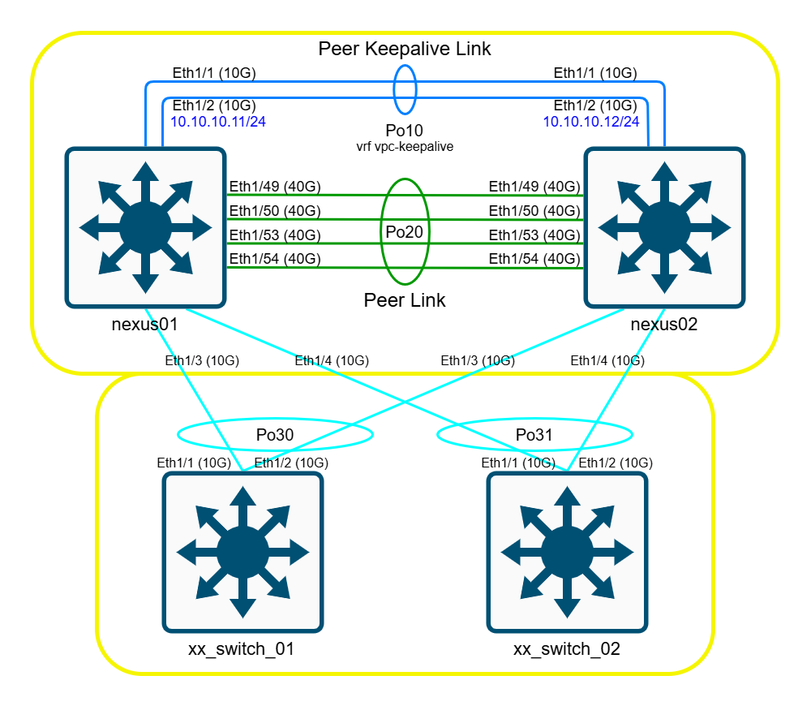

Cisco Nexus Switch 設定指南
================================================================================
v20250303 (Sensitive information has been modified or deleted.)


## 0. 重置 Switch

* 開機的時候按住 `Ctrl` + `]`，直到進入 boot 畫面

```go
(boot)# write erase     //清除所有資料。

(boot)# reload          //重啟 Switch 。
This command will reboot this supervisor module. (y/n) ? y      //按 "y" 即重啟。
```

* 重啟完後，看到以下問句，輸入 `skip` 。
```
Abort Power On Auto Provisioning [yes - continue with normal setup, skip - bypass password and basic configuration, no - continue with Power On Auto Provisioning] (yes/skip/no)[no]:
skip
```


## 1. 初始化設定


* 注意命令前面的 `#` 符號的變化，代表不同的模式：
  * 單純一個 `#`：登入 switch 後最基礎的模式，在此模式下只能查看不能設定。
  * `(config)#`：設定模式，由 `#` 模式下輸入以下指令即進入。
    ```
    # configure terminal
    ```
  * `(config-xxx)#`：`xxx` 通常會寫介面種類，由設定模式進入介面設定時才會出現這個。

### 檢查 Port Mode

請先檢查 Switch 的 **`Port Mode`**，並確認 40G port 沒有被分割成 10G*4，如果有被分割，請參照 **Cisco Nexus 3000/9000 統一介面分支配置 (Nexus 3000/9000 Consolidated Interface)** 文件來做修改。

可以使用 `show interface status` 或看 `show running-config` 來確認目前的設定。

### 設定機器名稱

```go
(config)# hostname <NAME>         //"<NAME>" 改成自訂名稱。
```

### 設定 Rapid Spanning Tree Protocol（RSTP）

```go
(config)# spanning-tree mode rapid-pvst
(config)# logging level spanning-tree 5         //設定 spanning-tree 紀錄 log 等級。
```

### 設定 Console timeout

```go
(config)# line console 
(config-console)# exec-timeout 10		//閒置多久登出，設 0 為永不登出。（取消 timeout）（單位：分）
```

### 建立新使用者

```go
(config)# username <NAME> password <PASS> role network-admin        //建立使用者並指定權限， "<NAME>" 替換成使用者名稱， "<PASS>" 替換成使用者密碼。
# show user-account           //顯示所有使用者。
# show role                   //顯示所有使用者權限群組。
```

### 設定 admin (預設帳號) 密碼

```go
(config)# username <NAME> password <PASS>        //建立使用者並指定權限， "<NAME>" 替換成使用者名稱， "<PASS>" 替換成使用者密碼。
                                                                    
# show user-account           //顯示所有使用者。
```

### 設定 IP address

```go
(config)# feature interface-vlan                //啟用 interface vlan 功能。
(config)# interface vlan <vlan編號>             //e.g. interface vlan 1  
(config-vlan)# ip address <A.B.C.D> <mask>      //e.g. ip address 192.168.0.1 255.255.255.0  
(config-vlan)# no shutdown                           //啟用介面。

(config)# ip route 0.0.0.0/0 192.168.0.254         //設定預設 gateway 。
```

### 設定 DNS

```go
(config)# ip domain-lookup                      //不用設，機器預設就會開啟。
(config)# ip name-server 8.8.8.8                //設定 DNS 。
```

### 設定 SSH

```go
(config)# no feature ssh                //關閉 SSH 服務。
(config)# ssh key rsa 2048 force        //強制重新產生一隻金鑰。
(config)# feature ssh                   //開啟 SSH 服務。
```

### 設定 NTP

```go
(config)# feature ntp                   	//開啟 NTP 服務。
(config)# clock timezone UTC 8 0        	//設定為台灣時區。
(config)# ntp source-interface vlan1    	//設定網路來源為 vlan 1 。
(config)# ntp server time.stdtime.gov.tw	//設定 NTP Server 。（外部 Server 用 ntp server，內部 Server 用 ntp peer 。）
     
# show ntp peer-status          //顯示 NTP Server / Peer 狀態。
# ntp sync-retry                //馬上同步時間。
# show clock                    //顯示時間。
```

### 儲存設定

`P.S. 此步驟非常重要，如果沒存檔，只要斷電或重啟設定通通都會不見。`  
`重要：儲存前請先確認設定檔正確。（# show running-config）`

```go
# copy running-config startup-config
```


## 2. Core Switch 設定

### 設定 vPC

* **架構圖**  
  

* **基礎設定** - 全部 Switch (nexus01 & nexus02)
  ```go
  (config)# feature vpc
  (config)# feature lacp                  //開啟 VPC & LACP 功能。
  (config)# interface ethernet 1/1-2
  (config-if-range)# channel-group 10 mode active
  (config-if-range)# description "port-channel 10"
  (config-if-range)# exit

  (config)# vrf context vpc-keepalive     //新增一個 VRF 叫 vpc-keepalive；VRF 可視作 L3 的 VLAN 。
  (config-vrf)# exit

  # show vrf              //查看 VRF 狀態
  ```

* **設定 Peer Keepalive** - nexus01
  ```go
  (config)# interface port-channel 10
  (config-if)# no switchport
  (config-if)# vrf member vpc-keepalive         //將 Po10 指定透過 vpc-keepalive 傳輸封包。
  (config-if)# ip address 10.10.10.11/24		//設定此台 keepalive 用的 IP，只要不跟現有使用網段衝突的 IP 即可。
  (config-if)# description "vpc-keepalive"
  (config-if)# no shutdown 
  (config-if)# exit

  (config)# vpc domain 1                        //新增一個 Domian 給 Peer Keepalive 用，串接的 Switch 需相同。
  (config-vpc-domain)# role priority 10         //指定優先順序，數字越小越優先。
                                                //下面這行指定 Peer Keepalive 的來源及目的地，並且指定 VRF，避免走預設 VRF 與 Peer Link 衝突。
  (config-vpc-domain)# peer-keepalive destination 10.10.10.12 source 10.10.10.11 vrf vpc-keepalive 
  (config-vpc-domain)# exit
  ```

* **設定 Peer Keepalive** - nexus02
  ```go
  (config)# interface port-channel 10
  (config-if)# no switchport
  (config-if)# vrf member vpc-keepalive
  (config-if)# ip address 10.10.10.12/24
  (config-if)# description "vpc-keepalive"
  (config-if)# no shutdown 
  (config-if)# exit

  (config)# vpc domain 1
  (config-vpc-domain)# role priority 20
  (config-vpc-domain)# peer-keepalive destination 10.10.10.11 source 10.10.10.12 vrf vpc-keepalive 
  (config-vpc-domain)# exit
  ```

* **設定 Peer Link** - 全部 Switch (nexus01 & nexus02)
  ```go
  (config)# interface ethernet 1/49         //因為 NX-OS 7 以下不支援用 if-range 把 40G port 加入 channel-group，故需分開加入。
  (config-if)# channel-group 20 mode active 
  (config-if)# no shutdown
  (config)# interface ethernet 1/50
  (config-if)# channel-group 20 mode active 
  (config-if)# no shutdown
  (config)# interface ethernet 1/53
  (config-if)# channel-group 20 mode active 
  (config-if)# no shutdown
  (config)# interface ethernet 1/54
  (config-if)# channel-group 20 mode active 
  (config-if)# no shutdown
  (config-if)# exit

  (config)# interface ethernet 1/49-50, ethernet 1/53-54
  (config-if-range)# description "port-channel 20"
  (config-if-range)# exit

  (config)# interface port-channel 20
  (config-if)# switchport 
  (config-if)# switchport mode trunk
  (config-if)# no shutdown
  (config-if)# vpc peer-link                //將 po20 指定為 Peer Link 。
  (config-if)# description "peer-link"
  (config-if)# exit

  # show vrf interface						//查看介面指定使用的 VRF 。
  # show port-channel summary				//查看 Port Channel 狀態。

  # ping <keepalive IP> vrf vpc-keepalive	//能 ping 通代表 Peer Keppalive 有設定成功。
  # show vpc brief                          //查看 vPC 狀態。
  ```

### 設定 port-channel 和其他 switch 建立連線。

* **Nexus Switch 部分** (nexus01 & nexus02)
  ```go
  (config)# interface ethernet 1/3
  (config-if)# channel-group 30 mode active 
  (config-if)# no shutdown
  (config-if)# description "port-channel 30"
  (config-if)# exit

  (config)# interface port-channel 30
  (config-if)# vpc 30                  //設定 vPC 編號，通常會跟 Port Channel 編號相同以便管理。
  (config-if)# description "vpc30"
  (config-if)# exit
  ```

* **Other Switch 部分**
  ```go
  (config)# feature lacp
  (config)# interface ethernet 1/1-2
  (config-if-range)# channel-group 30 mode active      //Port Channel 編號與 Nexus Switch 相同的話會比較方便管理。
  (config-if-range)# no shutdown 
  (config-if-range)# description "port-channel 30"
  (config-if-range)# exit

  (config)# interface port-channel 30
  (config-if)# description "uplink"
  (config-if)# exit
  ```
  
  
  
